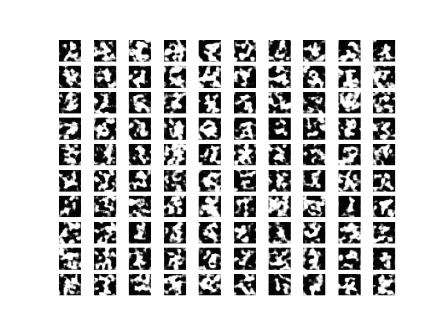
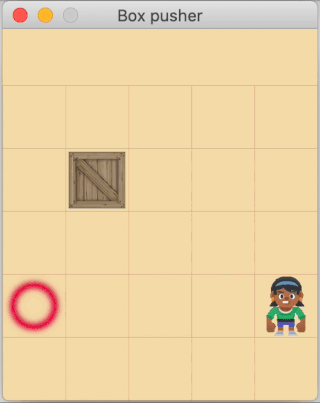

# Artificial neural networks

A few neural network training experiments.

### Trainings using Keras / TensorFlow

<table>
    <tbody>
        <tr></tr>
        <tr>
            <td align="left"><a href="digits#readme"><b>Digits recognition + generation</b></a></td>
        </tr>
        <tr>
            <td align="center">
                
            </td>
        </tr>
    </tbody>
</table>

### Trainings using NEAT

<table>
    <tbody>
        <tr></tr>
        <tr>
            <td colspan="2" align="left"><a href="racer#readme"><b>Track race</b></a></td>
        </tr>
        <tr>
            <td align="center" height="360">
                
            </td>
            <td align="center">
                
            </td>
        </tr>
        <tr>
            <td colspan="2" align="left"><a href="boxpusher#readme"><b>Box pusher</b></a></td>
        </tr>
        <tr>
            <td align="center" height="360">
                
            </td>
            <td align="center">
                
            </td>
        </tr>
        <tr>
            <td colspan="2" align="left"><a href="chatter#readme"><b>Chatter box</b></a>: terminal chat with limited responses</td>
        </tr>
    </tbody>
</table>
