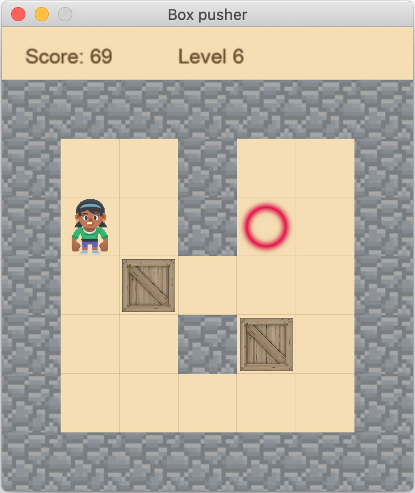
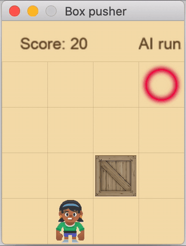
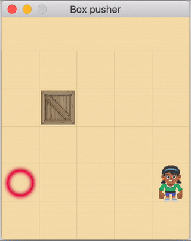
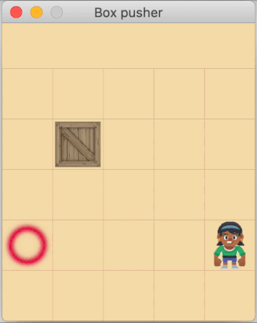

# Box pusher game

<table>
    <tbody>
        <tr></tr>
        <tr>
          <th colspan="3" align="left">Play manually</th>
          <th colspan="3" align="left">Auto player demo</th>
        </tr>
        <tr>
            <td colspan="3" align="center"></td>
            <td colspan="3" align="center"></td>
        </tr>
        <tr><th colspan="6" align="left">Train NEAT network</th></tr>
        <tr>
            <td colspan="2" align="center">
                <p>Beginner</p>
                
            </td>
            <td colspan="2" align="center">
                <p>Advanced</p>
                
            </td>
            <td colspan="2" align="center">
                <p>Expert</p>
                
            </td>
        </tr>
    </tbody>
</table>

#### Requirements
Python 3, 
[NumPy](https://pypi.org/project/numpy/), 
[NEAT-Python](https://pypi.org/project/neat-python/), 
[Arcade](https://pypi.org/project/arcade/)

#### Install dependencies

```bash
pip3 install -r requirements.txt
```

#### Run game manually

```bash
python3 src/manual_player.py
```

#### Demo auto player

A demonstration of `AutoPlayer`, mainly used during development.
```bash
python3 src/auto_player.py
```

### Train NEAT network

```bash
python3 src/training.py
[2020-04-07 12:57:53] --- START ---
[2020-04-07 12:57:54] g:    1, bm:   357, w/l:     0 /  25,000
 ───  p/s: 250/ 2, avg: -86.3 max a/f: -86.3[   1] / -40.5[   1], gen a/b: -86.3 / -40.5 ( 4-20)
[2020-04-07 12:57:56] g:    2, bm:   502, w/l:     0 /  25,000
 ───  p/s: 250/ 2, avg: -76.0 max a/f: -76.0[   2] / -34.5[   2], gen a/b: -65.7 / -34.5 ( 4-20)
[2020-04-07 12:57:57] g:    3, bm:   426, w/l:     8 /  24,992
 ───  p/s: 250/ 2, avg: -67.2 max a/f: -67.2[   3] / -34.5[   2], gen a/b: -49.6 / -39.5 ( 4-20)
[2020-04-07 12:57:59] g:    4, bm:   601, w/l:    14 /  24,986
 ───  p/s: 250/ 2, avg: -61.8 max a/f: -61.8[   4] / -34.5[   2], gen a/b: -45.9 / -34.9 ( 5-19)
[2020-04-07 12:58:00] g:    5, bm:   927, w/l:    19 /  24,981
 ───  p/s: 250/ 2, avg: -57.5 max a/f: -57.5[   5] / -26.9[   5], gen a/b: -40.1 / -26.9 ( 6-21)
...
```

#### Log message details:

| Key | Description |
|---:|---|
| **g:** | generation counter |
| **bm:** | # of box moves in generation |
| **w/l:** | # of won/lost games in generation |
| **p/s:** | generation population count / species count |
| **avg:** | rolling average fitness for all generations |
| **max a/f:** | **maximum** rolling average fitness / best genome fitness <br> (with the generation # when the maximum occurred in square brackets) |
| **gen a/b:** | **current** generation average fitness / best genome fitness <br> (node - connection count of best genome in brackets) |

---
<br>

# Chatter box

Chat with 4 possible responses and **very** limited character recognition

### Start training:

Training sessions use configuration in `chatter/chatter.cfg`. Abort training/chat at any time with `Ctrl-C`

```bash
python3 chatter
```

The first time a network scores over [96, 98, 99, 99.5] percent 
of the maximum fitness, a demo chat-session will be started:

```
...
[2020-04-03 11:38:11]    11: 1, avg: 72.44 max a/f 72.44[  11] / 128.72[  10], gen a/b: 94.29 (125.54  4-26)
[2020-04-03 11:38:11]    12: 1, avg: 74.83 max a/f 74.83[  12] / 132.31[  12], gen a/b: 101.16 (132.31  4-23)
[2020-04-03 11:38:12]    13: 1, avg: 75.95 max a/f 75.95[  13] / 132.31[  12], gen a/b: 89.35 (121.04  5-28)
[2020-04-03 11:38:12]    14: 1, avg: 77.24 max a/f 77.24[  14] / 132.31[  12], gen a/b: 93.99 (125.17  4-25)

DEMO chat percent 0.96, fitness: 134.99
Wer bist du? (beenden mit 'exit')
>> _
```

#### Save network
This chat session supports saving the current network to a file with `save [filename]`.
It'll use the current directory and adds `.net` as extension (if missing).

```
DEMO chat percent 0.96, fitness: 134.99

Wer bist du? (beenden mit 'exit')
>> save first
net saved: first.net
>> _
```

#### Load network
To load a network from file, start chatter with `run [filename]` parameters:

```
python3 chatter run first.net

Wer bist du? (beenden mit 'exit')
>> _
``` 