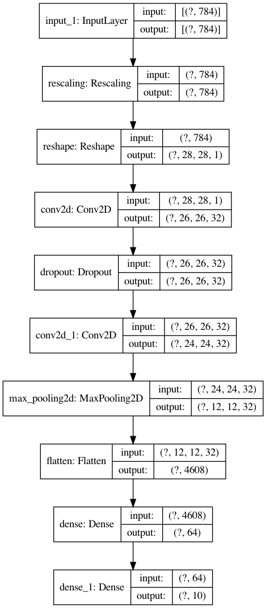
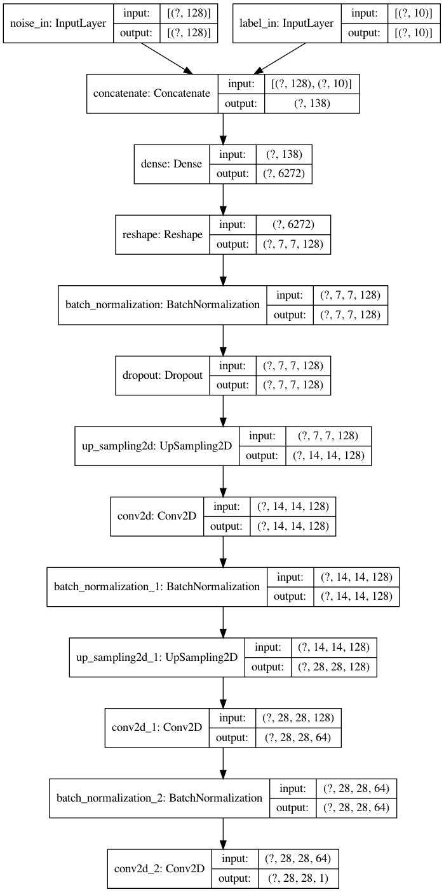
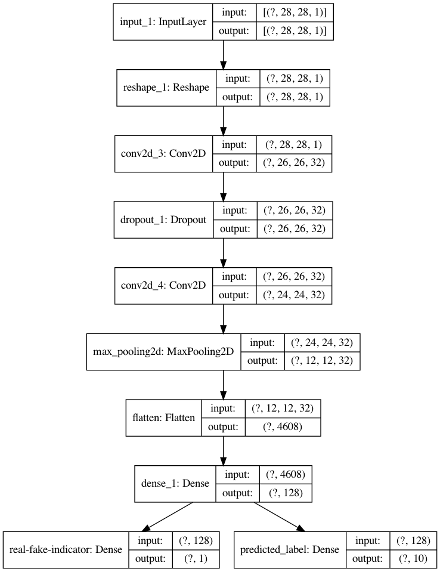
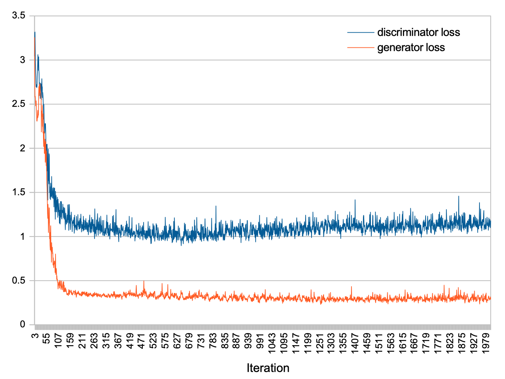

# Digits recognition + generation

Recognise + generate handwritten digits (data source: https://www.kaggle.com/c/digit-recognizer)

Example training:

<p align="center">

<small>"Not great, not terrible"</small>
</p>


#### Requirements
Python 3,
[TensorFlow](https://www.tensorflow.org/), 
[pandas](https://pandas.pydata.org/), 
[Pillow](https://pillow.readthedocs.io/en/stable/), 
[Matplotlib](https://matplotlib.org/), 
[NumPy](https://pypi.org/project/numpy/) 

#### Install dependencies

```bash
pip3 install -r requirements.txt
```

### Digit recognition:

For digit recognition a simple convolutional network model is used:

<p align="center"></p>

Start digit recognition training with:
```bash
python3 digits_training.py
```

### Digit generation:

For digit generation a generative adversarial network (GAN) is used.

<table>
    <tbody>
        <tr></tr>
        <tr>
          <th align="center">Generator</th>
          <th align="center">Discriminator</th>
        </tr>
        <tr>
            <td align="center"></td>
            <td align="center"></td>
        </tr>
    </tbody>
</table>

Start digit recognition training with:
```bash
python3 digits_gan.py
```

With default settings, the training uses 2000 iterations and stores generated digit samples after 25 iterations.
Additionally, a CSV file with the generator loss and discriminator loss is stored (both in `log` folder).

Example loss diagram:

<p align="center"></p>