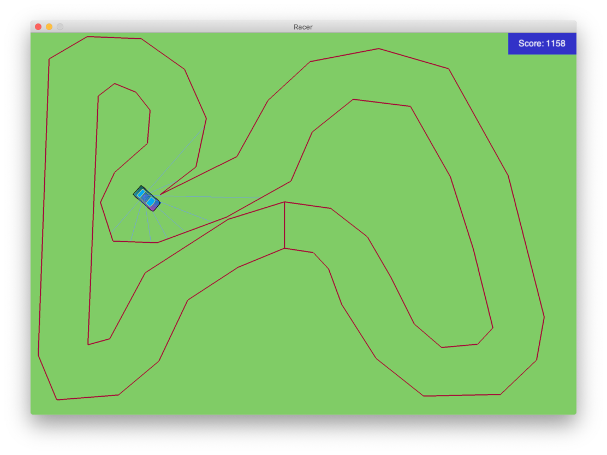

# Racer

#### Manual player



#### Requirements
Python 3, 
[NumPy](https://pypi.org/project/numpy/), 
[NEAT-Python](https://pypi.org/project/neat-python/), 
[pyglet](http://pyglet.org/),
[Shapely](https://pypi.org/project/Shapely/)

#### Install dependencies

```bash
[project-root-dir] $ pip3 install -r requirements.txt
```

#### Run game manually

Single-player mode
```bash
[project-root-dir] $ python3 racer
```

2-player mode
```bash
[project-root-dir] $ python3 racer 2
```

#### Demo auto player

Demo player, mainly used during development.
```bash
python3 racer demo
```