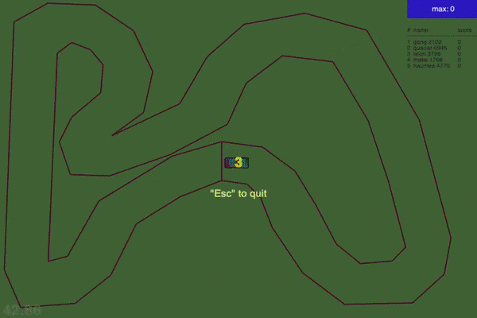
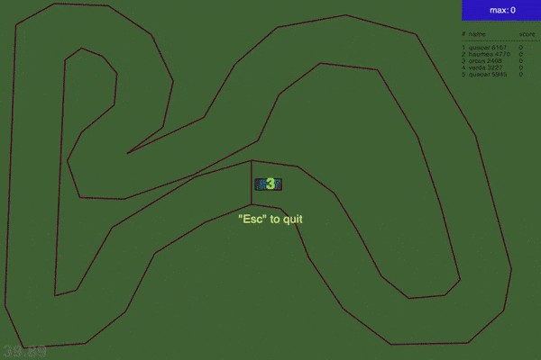
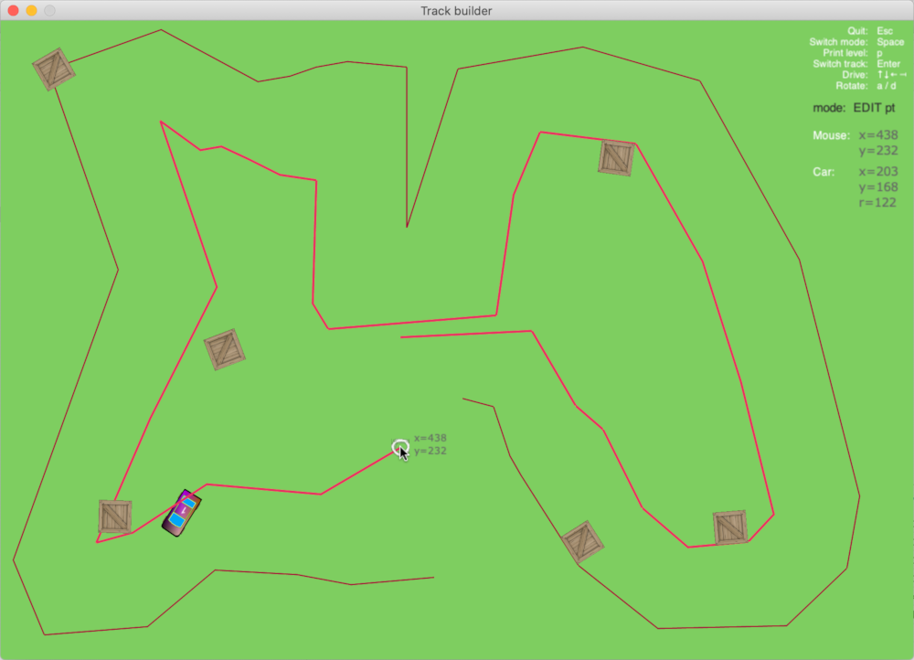

# Track race

- Getting started
	- [Requirements](#requirements)
	- [Install dependencies](#install-dependencies)
- Play
	- [Single-player](#single-player-mode)
	- [Two-player](#two-player-mode)
	- [automatic play demonstration](#demo-auto-player)
- [Train networks](#train-neat-network)
	- [Configuration](#configuration)
	- [Start training](#start-training)
	- [Run race with stored players](#replay-stored-players)
    - ~~[Run race with top players](#replay-top-players)~~ (temporarily not working)
- [Build your own track](#track-builder)

<table>
    <tbody>
        <tr></tr>
        <tr>
          <th colspan="2" align="left">Training examples (sped up)</th>
        </tr>
        <tr>
            <td align="center"></td>
            <td align="center"></td>
        </tr>
    </tbody>
</table>

**Full recordings (original speed): [training_0](docs/net-run-0.mp4), 
[training_1](docs/net-run-1.mp4), [training_2](docs/net-run-2.mp4)**

#### Requirements
Python 3, 
[NEAT-Python](https://pypi.org/project/neat-python/), 
[NumPy](https://pypi.org/project/numpy/), 
[pyglet](http://pyglet.org/),
[Shapely](https://pypi.org/project/Shapely/)

#### Install dependencies

```bash
[project-root-dir] $ pip3 install -r requirements.txt
```

#### Start parameters

```bash
[project-root-dir] $ python3 racer help
Parameters:
	[none]      	single-player mode
	2           	two-player mode
	demo        	demo mode
	train       	training mode
	play <files>	showcase best players from <files>
	top         	showcase random players from 'racer/examples/top_players.pd'
	build       	open track builder
```

#### Single-player mode

```bash
[project-root-dir] $ python3 racer
```

#### Two-player mode

```bash
[project-root-dir] $ python3 racer 2
```

#### Demo auto player

Demo player, mainly used during development.
```bash
[project-root-dir] $ python3 racer demo
```

### Train NEAT network

General introduction to NEAT training: https://neat-python.readthedocs.io/en/latest/

Each generation is trained on all tracks specified by `TRAINING_LEVELS` in [tracks.py](game/tracks.py).
The genome fitness criteria is sum of the distance (**= score**) travelled on all trainings tracks
from start-/finish-line, until:
- player touches track outlines
- distance is negative (ie moves backwards)
- score-points per seconds less than 20
- level-limit is reached (see track definitions in [tracks.py](game/tracks.py))

A training top-list is updated after every generation (see `keep_best_players` configuration). 
If the top-list is updated, a copy is saved in directory `racer/best-players`. 

A fitness summary is logged after each batch (see `showcase_every_gen` + `showcase_racer_count` configuration),
and a showcase with the best genomes/players of the current generation is presented.

#### Configuration

NEAT configuration file: [training.cfg](neural/training.cfg) (see also [NEAT-Python configuration](https://neat-python.readthedocs.io/en/latest/config_file.html))

Additional to the NEAT-configuration, following parameters required: 

```
[TRAINING]
processes              = 6
keep_best_players      = 10
keep_fitness_threshold = 6000
showcase_every_gen     = 10
showcase_racer_count   = 5
```

| Key | Description |
|---|---|
| **processes** | number of processes used in training/showcasing |
| **keep_best_players** | number of top-players to keep during training |
| **keep_fitness_threshold** | required minimum fitness for keeping players |
| **showcase_every_gen** | batch-size: showcase every n-th generation |
| **showcase_racer_count** | racers in a showcase |


### Start training

```bash
[project-root-dir] $ python3 racer train
loading config file: <anns/racer/training.cfg>
[2020-04-20 15:28:13] --- START ---
[2020-04-20 15:28:24] g:  1, p/s: 70/ 3, avg:   -1, max a/f:   -1[  1]/  71[  1], gen a/b:   -1/  71 ( 4-40 #31)
[2020-04-20 15:28:34] g:  2, p/s: 70/ 4, avg:    1, max a/f:    1[  2]/  74[  2], gen a/b:    2/  74 ( 4-39 #119)
[2020-04-20 15:28:44] g:  3, p/s: 69/ 4, avg:    5, max a/f:    5[  3]/ 114[  3], gen a/b:   13/ 114 ( 5-39 #165)
[2020-04-20 15:29:01] g:  4, p/s: 69/ 4, avg:    8, max a/f:    8[  4]/ 115[  4], gen a/b:   18/ 115 ( 5-39 #252)
[2020-04-20 15:29:20] g:  5, p/s: 70/ 5, avg:   12, max a/f:   12[  5]/ 115[  4], gen a/b:   30/ 115 ( 5-39 #252)
__________________________________________________▏batch fitness:    4,308
Showcase: 5 players (fit/sps) 115/38.7, 99/37.1, 99/37.2, 92/35.7, 87/33.6
Showcases finished, waiting 3 seconds to exit...
[2020-04-20 15:29:37] g:  6, p/s: 70/ 8, avg:   17, max a/f:   17[  6]/ 115[  4], gen a/b:   41/ 114 ( 5-39 #252)
[2020-04-20 15:29:55] g:  7, p/s: 70/ 8, avg:   22, max a/f:   22[  7]/ 115[  4], gen a/b:   49/ 114 ( 5-39 #252)
...
```

#### Log message details:

| Key | Description |
|---:|---|
| **g:** | generation counter |
| **p/s:** | generation population count / species count |
| **avg:** | rolling average fitness for all generations |
| **max a/f:** | **maximum** rolling average fitness / best genome fitness <br> (with the generation # when the maximum occurred in square brackets) |
| **gen a/b:** | **current** generation average fitness / best genome fitness <br> (node-/connection-count and genome-key of best genome in brackets) |
| **batch fitness** | fitness sum of all generation in batch |
| **fit/sps** | fitness/score-points per second |

### Replay stored players

To run a showcase with players stored in directory `racer/best_players`, start with `play`: 

```bash
[project-root-dir] $ python3 racer play racer/best_players/20200418-165907_best.pd
[2020-04-20 15:26:53] --- START ---
genome file read: racer/best_players/20200418-165907_best.pd
Showcase: 5 players (fit/sps) 4506/49.8, 4505/49.7, 4500/49.2, 4499/49.5, 2268/50.5
Showcases finished, waiting 3 seconds to exit...
```

### Replay top players

**Temporarily not working due to changes in tracing lines (sensors for nn)**

The player-store file [examples/top_players.pd](examples/top_players.pd) contains the top-10 players from all player-store files in [examples/](examples).
A shortcut to run a random selection of these top players it `top`:

```bash
[project-root-dir] $ python3 racer top
```

### Track builder

<p align="center"></p>

To start building your own track:

```bash
[project-root-dir] $ python3 racer build
```

