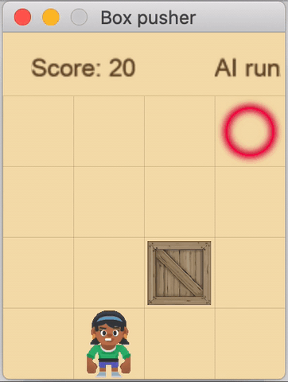

# Box pusher game

<table>
    <tbody>
        <tr></tr>
        <tr>
          <th colspan="3" align="left">Play manually</th>
          <th colspan="3" align="left">Auto player demo</th>
        </tr>
        <tr>
            <td colspan="3" align="center"></td>
            <td colspan="3" align="center"></td>
        </tr>
        <tr><th colspan="6" align="left">Train NEAT network</th></tr>
        <tr>
            <td colspan="2" align="center">
                <p>Beginner</p>
                
            </td>
            <td colspan="2" align="center">
                <p>Advanced</p>
                
            </td>
            <td colspan="2" align="center">
                <p>Expert</p>
                
            </td>
        </tr>
    </tbody>
</table>

#### Requirements
Python 3, 
[Arcade](https://pypi.org/project/arcade/),
[NEAT-Python](https://pypi.org/project/neat-python/), 
[NumPy](https://pypi.org/project/numpy/)

#### Install dependencies

```bash
[project-root-dir] $ pip3 install -r requirements.txt
```

#### Run game manually

```bash
[project-root-dir] $ python3 src/manual_player.py
```

#### Demo auto player

A demonstration of `AutoPlayer`, mainly used during development.
```bash
[project-root-dir] $ python3 src/auto_player.py
```

### Train NEAT network

```bash
[project-root-dir] $ python3 src/training.py
[2020-04-07 12:57:53] --- START ---
[2020-04-07 12:57:54] g:[   1], bm:   357, w/l:     0 /  25,000
 ───  p/s: 250/ 2, avg: -86.3 max a/f: -86.3[   1] / -40.5[   1], gen a/b: -86.3 / -40.5 ( 4-20) abs: 0 cla:100 rel: 0 sig: 0
[2020-04-07 12:57:56] g:[   2], bm:   502, w/l:     0 /  25,000
 ───  p/s: 250/ 2, avg: -76.0 max a/f: -76.0[   2] / -34.5[   2], gen a/b: -65.7 / -34.5 ( 4-20) abs: 1 cla:97 rel: 1 sig: 2
[2020-04-07 12:57:57] g:[   3], bm:   426, w/l:     8 /  24,992
 ───  p/s: 250/ 2, avg: -67.2 max a/f: -67.2[   3] / -34.5[   2], gen a/b: -49.6 / -39.5 ( 4-20) abs: 0 cla:98 rel: 0 sig: 2
[2020-04-07 12:57:59] g:[   4], bm:   601, w/l:    14 /  24,986
 ───  p/s: 250/ 2, avg: -61.8 max a/f: -61.8[   4] / -34.5[   2], gen a/b: -45.9 / -34.9 ( 5-19) abs: 2 cla:95 rel: 2 sig: 2
[2020-04-07 12:58:00] g:[   5], bm:   927, w/l:    19 /  24,981
 ───  p/s: 250/ 2, avg: -57.5 max a/f: -57.5[   5] / -26.9[   5], gen a/b: -40.1 / -26.9 ( 6-21) abs: 2 cla:95 rel: 2 sig: 2
...
```

#### Log message details:

| Key | Description |
|---:|---|
| **g:** | generation counter |
| **bm:** | # of box moves in generation |
| **w/l:** | # of won/lost games in generation |
| **p/s:** | generation population count / species count |
| **avg:** | rolling average fitness for all generations |
| **max a/f:** | **maximum** rolling average fitness / best genome fitness <br> (with the generation # when the maximum occurred in square brackets) |
| **gen a/b:** | **current** generation average fitness / best genome fitness <br> (node - connection count of best genome in brackets) |
| **abs:** <br> **cla:** <br> **rel:** <br> **sig:** <br> **...** | percentages of activation functions used (see [activation options @NEAT-Python](https://neat-python.readthedocs.io/en/latest/config_file.html#activation-function-config-label)) |
